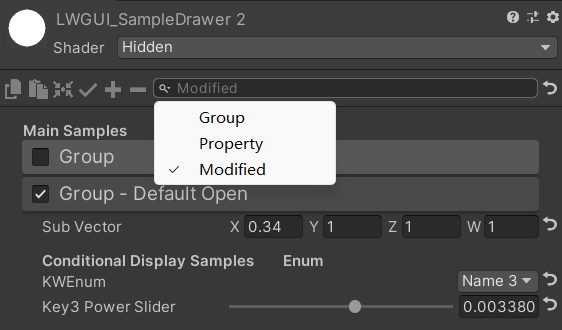
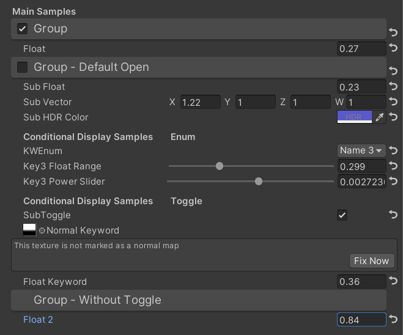
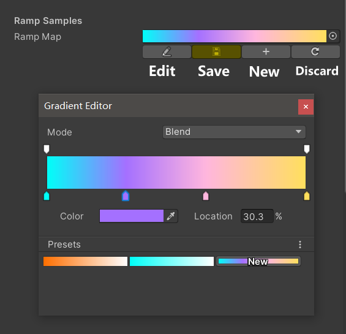
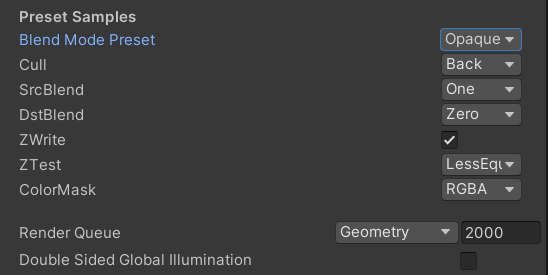
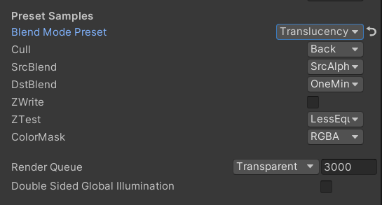

# LWGUI (Light Weight Shader GUI)

[中文](https://github.com/JasonMa0012/LWGUI/blob/dev/README_CN.md) | [English](https://github.com/JasonMa0012/LWGUI)

一个轻量, 灵活, 强大的**Unity Shader GUI**系统.

使用简洁的MaterialPropertyDrawer语法实现功能复杂的Shader GUI, 节省大量开发时间, 易于使用和扩展, 有效提升美术的使用体验.




| With your sponsorship, I will update more actively. | 有你的赞助我会更加积极地更新                                 |
| --------------------------------------------------- | ------------------------------------------------------------ |
| PayPal                                              | 支付宝                                                       |
| [paypal.me/JasonMa0012](paypal.me/JasonMa0012)      |  |


- [LWGUI (Light Weight Shader GUI)](#lwgui--light-weight-shader-gui-)
  * [Installation](#installation)
  * [Usage](#usage)
    + [Getting Started](#getting-started)
    + [LWGUI Drawers](#lwgui-drawers)
      - [Main - Sub](#main---sub)
      - [SubToggle](#subtoggle)
      - [SubPower](#subpower)
      - [KWEnum](#kwenum)
      - [SubEnum - SubKeywordEnum](#subenum---subkeywordenum)
      - [Tex - Color](#tex---color)
      - [Channel](#channel)
      - [Ramp](#ramp)
      - [MinMaxSlider](#minmaxslider)
    + [LWGUI Decorator](#lwgui-decorator)
      - [Title](#title)
      - [Tooltip - Helpbox](#tooltip---helpbox)
    + [Unity Builtin Drawers](#unity-builtin-drawers)
      - [Space](#space)
      - [Header](#header)
      - [Enum](#enum)
      - [IntRange](#intrange)
      - [KeywordEnum](#keywordenum)
      - [PowerSlider](#powerslider)
      - [Toggle](#toggle)
    + [Tips](#tips)
  * [TODO](#todo)
  * [Contribution](#contribution)
    + [Tips](#tips-1)

## Installation

1. 确保你的环境兼容LWGUI: **Unity 2017.4+**
2. 打开已有工程
3. （可能需要全局代理）`Window > Package Manager > Add > Add package from git URL` 输入`https://github.com/JasonMa0012/LWGUI.git`

   - 你也可以选择手动从Github下载Zip，然后从`Package Manager > Add package from disk`添加Local Package
   - 对于Unity 2017, 请直接将Zip解压到Assets目录

## Usage

### Getting Started

1. 新建一个Shader或使用现有的Shader
2. 在代码编辑器中打开Shader
3. 在Shader最底部, 最后一个大括号之前, 添加行:`CustomEditor "LWGUI.LWGUI"`
4. 完成! 开始使用以下功能强大的Drawer轻松绘制你的ShaderGUI吧
   - MaterialPropertyDrawer是一种类似C# Attribute的语法, 在MaterialProperty前加上Drawer可以更改绘制方式, 更多信息可以查看官方文档:`https://docs.unity3d.com/ScriptReference/MaterialPropertyDrawer.html`

### LWGUI Drawers

#### Main - Sub

```c#
/// Create a Folding Group
/// group：group name (Default: Property Name)
/// keyword：keyword used for toggle, "_" = ignore, none or "__" = Property Name +  "_ON", always Upper (Default: none)
/// default Folding State: "on" or "off" (Default: off)
/// default Toggle Displayed: "on" or "off" (Default: on)
/// Target Property Type: FLoat, express Toggle value
MainDrawer(string group, string keyword, string defaultFoldingState, string defaultToggleDisplayed)
```

```c#
/// Draw a property with default style in the folding group
/// group：father group name, support suffix keyword for conditional display (Default: none)
/// Target Property Type: Any
SubDrawer(string group)
```

Example:

```c#
[Title(Main Samples)]
[Main(GroupName)]
_group ("Group", float) = 0
[Sub(GroupName)] _float ("Float", float) = 0


[Main(Group1, _KEYWORD, on)] _group1 ("Group - Default Open", float) = 1
[Sub(Group1)] _float1 ("Sub Float", float) = 0
[Sub(Group1)] _vector1 ("Sub Vector", vector) = (1, 1, 1, 1)
[Sub(Group1)] [HDR] _color1 ("Sub HDR Color", color) = (0.7, 0.7, 1, 1)

[Title(Group1, Conditional Display Samples       Enum)]
[KWEnum(Group1, Name 1, _KEY1, Name 2, _KEY2, Name 3, _KEY3)]
_enum ("KWEnum", float) = 0

// Display when the keyword ("group name + keyword") is activated
[Sub(Group1_KEY1)] _key1_Float1 ("Key1 Float", float) = 0
[Sub(Group1_KEY2)] _key2_Float2 ("Key2 Float", float) = 0
[Sub(Group1_KEY3)] _key3_Float3_Range ("Key3 Float Range", Range(0, 1)) = 0
[SubPowerSlider(Group1_KEY3, 10)] _key3_Float4_PowerSlider ("Key3 Power Slider", Range(0, 1)) = 0

[Title(Group1, Conditional Display Samples       Toggle)]
[SubToggle(Group1, _TOGGLE_KEYWORD)] _toggle ("SubToggle", float) = 0
[Tex(Group1_TOGGLE_KEYWORD)][Normal] _normal ("Normal Keyword", 2D) = "bump" { }
[Sub(Group1_TOGGLE_KEYWORD)] _float2 ("Float Keyword", float) = 0


[Main(Group2, _, off, off)] _group2 ("Group - Without Toggle", float) = 0
[Sub(Group2)] _float3 ("Float 2", float) = 0

```

Default result:


Then change values:



#### SubToggle

```c#
/// Similar to builtin Toggle()
/// group：father group name, support suffix keyword for conditional display (Default: none)
/// keyword：keyword used for toggle, "_" = ignore, none or "__" = Property Name +  "_ON", always Upper (Default: none)
/// Target Property Type: FLoat
SubToggleDrawer(string group, string keyWord)
```


#### SubPower

```c#
/// Similar to builtin PowerSlider()
/// group：father group name, support suffix keyword for conditional display (Default: none)
/// power: power of slider (Default: 1)
/// Target Property Type: Range
SubPowerSliderDrawer(string group, float power)
```


#### SubIntRange

```c#
/// Similar to builtin IntRange()
/// group：father group name, support suffix keyword for conditional display (Default: none)
/// Target Property Type: Range
SubIntRangeDrawer(string group)
```


#### KWEnum

```c#
/// <summary>
/// Similar to builtin Enum() / KeywordEnum()
/// group：father group name, support suffix keyword for conditional display (Default: none)
/// n(s): display name
/// k(s): keyword
/// v(s): value
/// Target Property Type: FLoat, express current keyword index
/// </summary>
KWEnumDrawer(string group, string n1, string k1, string n2, string k2, string n3, string k3, string n4, string k4, string n5, string k5)
```


#### SubEnum - SubKeywordEnum

```c#
// enumName: like "UnityEngine.Rendering.BlendMode"
SubEnumDrawer(string group, string enumName)
    
SubEnumDrawer(string group, string n1, float v1, string n2, float v2, string n3, float v3, string n4, float v4, string n5, float v5, string n6, float v6, string n7, float v7)

SubKeywordEnumDrawer(string group, string kw1, string kw2, string kw3, string kw4, string kw5, string kw6, string kw7, string kw8, string kw9)
```


#### Tex - Color

```c#
/// Draw a Texture property in single line with a extra property
/// group：father group name, support suffix keyword for conditional display (Default: none)
/// extraPropName: extra property name (Unity 2019.2+ only) (Default: none)
/// Target Property Type: Texture
/// Extra Property Type: Any, except Texture
TexDrawer(string group, string extraPropName)
```

```c#
/// Display up to 4 colors in a single line
/// group：father group name, support suffix keyword for conditional display (Default: none)
/// color2-4: extra color property name (Unity 2019.2+ only)
/// Target Property Type: Color
ColorDrawer(string group, string color2, string color3, string color4)
```

Example:

```c#
[Main(Group3, _, on)] _group3 ("Group - Tex and Color Samples", float) = 0
[Tex(Group3, _color)] _tex_color ("Tex with Color", 2D) = "white" { }
[HideInInspector] _color (" ", Color) = (1, 0, 0, 1)
[Tex(Group3, _float4)] _tex_float ("Tex with Float", 2D) = "white" { }
[HideInInspector] _float4 (" ", float) = 0
[Tex(Group3, _range)] _tex_range ("Tex with Range", 2D) = "white" { }
[HideInInspector] _range (" ", Range(0,1)) = 0
[Tex(Group3, _textureChannelMask1)] _tex_channel ("Tex with Channel", 2D) = "white" { }
[HideInInspector] _textureChannelMask1(" ", Vector) = (0,0,0,1)

// Display up to 4 colors in a single line (Unity 2019.2+)
[Color(Group3, _mColor1, _mColor2, _mColor3)]
_mColor ("Multi Color", Color) = (1, 1, 1, 1)
[HideInInspector] _mColor1 (" ", Color) = (1, 0, 0, 1)
[HideInInspector] _mColor2 (" ", Color) = (0, 1, 0, 1)
[HideInInspector] [HDR] _mColor3 (" ", Color) = (0, 0, 1, 1)

```

Result:


#### Channel

```c#
/// Draw a R/G/B/A drop menu:
/// 	R = (1, 0, 0, 0)
/// 	G = (0, 1, 0, 0)
/// 	B = (0, 0, 1, 0)
/// 	A = (0, 0, 0, 1)
/// 	RGB Average = (1f / 3f, 1f / 3f, 1f / 3f, 0)
/// 	RGB Luminance = (0.2126f, 0.7152f, 0.0722f, 0)
///		None = (0, 0, 0, 0)
/// group：father group name, support suffix keyword for conditional display (Default: none)
/// Target Property Type: Vector, used to dot() with Texture Sample Value 
ChannelDrawer(string group)
```

Example:

```c#
[Title(_, Channel Samples)]
[Channel(_)]_textureChannelMask("Texture Channel Mask (Default G)", Vector) = (0,1,0,0)

......

float selectedChannelValue = dot(tex2D(_Tex, uv), _textureChannelMask);
```


#### Ramp

```c#
/// Draw a Ramp Map Editor (Defaulf Ramp Map Resolution: 512 * 2)
/// group：father group name, support suffix keyword for conditional display (Default: none)
/// defaultFileName: default Ramp Map file name when create a new one (Default: RampMap)
/// rootPath: the path where ramp is stored, replace '/' with '.' (for example: Assets.Art.Ramps). when selecting ramp, it will also be filtered according to the path (Default: Assets)
/// defaultWidth: default Ramp Width (Default: 512)
/// Target Property Type: Texture2D
RampDrawer(string group, string defaultFileName, string rootPath, float defaultWidth)
```

Example:

```c#
[Ramp(_, RampMap, Assets.Art, 512)] _Ramp ("Ramp Map", 2D) = "white" { }

```

Result:


Ramp编辑器:



你**必须手动保存编辑结果**, 如果有未保存的修改, Save按钮将显示黄色.

**在你移动或者复制RampMap的时候, 切记要连同.meta文件一起移动, 否则将无法再次编辑!**

#### MinMaxSlider

```c#
/// Draw a min max slider (Unity 2019.2+ only)
/// group：father group name, support suffix keyword for conditional display (Default: none)
/// minPropName: Output Min Property Name
/// maxPropName: Output Max Property Name
/// Target Property Type: Range, range limits express the MinMaxSlider value range
/// Output Min/Max Property Type: Range, it's value is limited by it's range
MinMaxSliderDrawer(string group, string minPropName, string maxPropName)
```
Example:

```c#
[Title(MinMaxSlider Samples)]
[MinMaxSlider(_rangeStart, _rangeEnd)] _minMaxSlider("Min Max Slider (0 - 1)", Range(0.0, 1.0)) = 1.0
_rangeStart("Range Start", Range(0.0, 0.5)) = 0.0
[PowerSlider(10)] _rangeEnd("Range End PowerSlider", Range(0.5, 1.0)) = 1.0

```

Result:


#### Preset

```c#
/// Popping a menu, you can select the Shader Property Preset, the Preset values will replaces the default values
/// group：father group name, support suffix keyword for conditional display (Default: none)
///	presetFileName: "Shader Property Preset" asset name, you can create new Preset by
///		"Right Click > Create > LWGUI > Shader Property Preset" in Project window,
///		*any Preset in the entire project cannot have the same name*
public PresetDrawer(string group, string presetFileName)
```

Example:

~~~c#
[Title(Preset Samples)]
[Preset(LWGUI_BlendModePreset)] _BlendMode ("Blend Mode Preset", float) = 0 
[Enum(UnityEngine.Rendering.CullMode)]_Cull("Cull", Float) = 2
[Enum(UnityEngine.Rendering.BlendMode)]_SrcBlend("SrcBlend", Float) = 1
[Enum(UnityEngine.Rendering.BlendMode)]_DstBlend("DstBlend", Float) = 0
[Toggle(_)]_ZWrite("ZWrite ", Float) = 1
[Enum(UnityEngine.Rendering.CompareFunction)]_ZTest("ZTest", Float) = 4 // 4 is LEqual
[Enum(RGBA,15,RGB,14)]_ColorMask("ColorMask", Float) = 15 // 15 is RGBA (binary 1111)
    
``````
    
Cull [_Cull]
ZWrite [_ZWrite]
Blend [_SrcBlend] [_DstBlend]
ColorMask [_ColorMask]
~~~

Result:

选择的预设内的属性值将成为默认值

**RenderQueue**是个特殊属性, 需要手动在预设中添加



##### Create Preset File


##### Edit Preset


### LWGUI Decorator

#### Title

```c#
/// Similar to Header()
/// group：father group name, support suffix keyword for conditional display (Default: none)
/// header: string to display, "SpaceLine" or "_" = none (Default: none)
/// height: line height (Default: 22)
TitleDecorator(string group, string header, float height)
```

#### Tooltip - Helpbox

```c#
/// Tooltip, describes the details of the property. (Default: property.name and property default value)
/// You can also use "#Text" in DisplayName to add Tooltip that supports Multi-Language.
/// tooltip：a single-line string to display, support up to 4 ','. (Default: Newline)
public TooltipDecorator(string tooltip)
```

```c#
/// Display a Helpbox on the property
/// You can also use "%Text" in DisplayName to add Helpbox that supports Multi-Language.
/// message：a single-line string to display, support up to 4 ','. (Default: Newline)
public HelpboxDecorator(string message)
```

Example:

```c#
[Title(Metadata Samples)]
[Tooltip(Test multiline Tooltip, a single line supports up to 4 commas)]
[Tooltip()]
[Tooltip(Line 3)]
[Tooltip(Line 4)]
_float_tooltip ("Float with Tooltips#这是中文Tooltip#これは日本語Tooltipです", float) = 1
[Helpbox(Test multiline Helpbox)]
[Helpbox(Line2)]
[Helpbox(Line3)]
_float_helpbox ("Float with Helpbox%这是中文Helpbox%これは日本語Helpboxです", float) = 1

```


#### PassSwitch

```c#
/// Cooperate with Toggle to switch certain Passes
/// lightModeName(s): Light Mode in Shader Pass (https://docs.unity3d.com/2017.4/Documentation/Manual/SL-PassTags.html)
PassSwitchDecorator(string   lightModeName1, string lightModeName2, string lightModeName3, string lightModeName4, string lightModeName5, string lightModeName6)
```


### Unity Builtin Drawers

#### Space

```c#
MaterialSpaceDecorator(float height)
```

#### Header

```c#
MaterialHeaderDecorator(string header)
```

#### Enum

```c#
MaterialEnumDrawer(string n1, float v1, string n2, float v2, string n3, float v3, string n4, float v4, string n5, float v5, string n6, float v6, string n7, float v7)
```


#### IntRange

```c#
MaterialIntRangeDrawer()
```


#### KeywordEnum

```c#
MaterialKeywordEnumDrawer(string kw1, string kw2, string kw3, string kw4, string kw5, string kw6, string kw7, string kw8, string kw9)
```


#### PowerSlider

```c#
MaterialPowerSliderDrawer(float power)
```


#### Toggle

```c#
MaterialToggleUIDrawer(string keyword)
```


### Tips

1. Drawer的第一个参数永远是`group`, 所以在只有一个参数的情况下, 不同Drawer的行为可能不同, 因此如果要在折叠组外使用Drawer, 第一个参数最好赋予“_”
1. 最好使用Title()替代内置的Header(), 否则会有错位
1. 如果出现改了Shader但GUI没有更新的情况请手动修改Shader使其报错, 然后再改回来以刷新GUI

## TODO

- [ ] 支持ShaderGraph or ASE
- [x] **per material保存折叠组打开状态**
- [x] 支持Unreal风格的Revertable GUI
- [x] **支持HelpBox**
- [ ] 支持改文字格式
- [x] **支持Tooltip, 显示默认值和自定义内容**
- [ ] **支持右上角菜单全部展开或折叠**
- [ ] 支持Pass开关
- [ ] 支持Curve
- [x] **支持搜索框**
- [x] **支持仅显示已修改项**
- [x] 支持预设管理器
- [x] 支持自适应枚举宽度
- [x] 支持2017
  - [x] 反射引擎私有函数
  - [ ] 复制属性菜单


## Contribution

1. 使用不同Unity版本创建多个空工程
2. 拉取repo
3. 使用符号链接将此repo放到所有工程的Assets或Packages目录内
4. 在`ShaderDrawer.cs`内继承`SubDrawer`开始开发你的自定义Drawer
5. 检查功能在不同Unity版本是否正常
6. Pull requests


